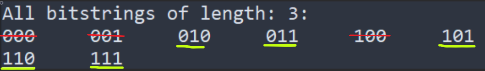
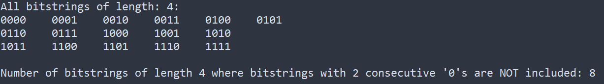
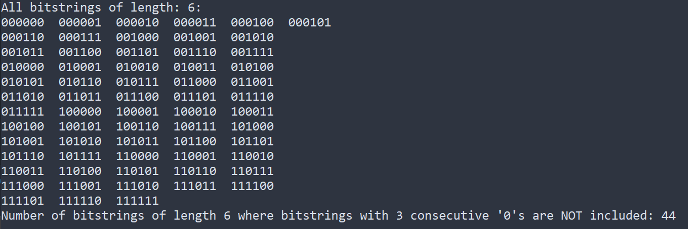

# dp-bitstrings
Determine the number of bitstrings with length 'n' that do not have 'k' repeating '0's (or '1's)

###### What does it mean to not consider consecutive bits?
<h1 style="font-size:10px">
Consider Binary Strings of length 3 and a k value of 2. This means we do not consider bitstrings that have '2' consecutive '0's.
</h1>

###### Example with n = 4 and k = 2

###### Example with n = 6 and k = 3
